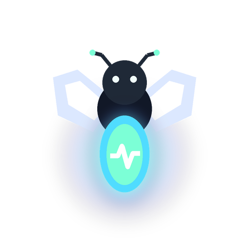

# Pulse

<p align="center">
  
</p>

**Your work, always in context.**

Pulse is a Windows desktop app that keeps human-and-AI work connected. It turns
your tasks, agent sessions, decisions, reminders, evidence, and handoffs into
one local activity record, so you can resume work without reconstructing the
context by hand.

[Download the latest Windows installer](https://github.com/anirudh-makuluri/pulse/releases/latest/download/Pulse-Setup-x64.exe) · [View all releases](https://github.com/anirudh-makuluri/pulse/releases/latest) · [Read the roadmap](docs/implementation-roadmap.md)

> **Early release:** Pulse is Windows-only and actively being developed. Your
> data stays on your machine by default.

## Install on Windows

1. [Download the latest Pulse installer](https://github.com/anirudh-makuluri/pulse/releases/latest/download/Pulse-Setup-x64.exe).
2. Run `Pulse-Setup-x64.exe`.
3. Open **Pulse** from the Start menu. The app starts its bundled local service
   automatically.

Pulse does not require Rust, Node.js, or an agent API key to install or use.
It stores its local data in `%LOCALAPPDATA%\Pulse\`.

If Windows shows a reputation warning, review the publisher and release page
before choosing whether to continue. Releases are not yet code-signed.

## What Pulse does today

- Keeps work in a lightweight **Inbox → Today / Next / Waiting → Done** flow.
- Lets you add, search, update, complete, and inspect tasks from the desktop
  app or CLI.
- Records a chronological activity timeline with linked sessions, events,
  checkpoints, evidence, reminders, memories, and artifacts.
- Watches user-enabled Claude and Codex session sources to infer task
  candidates, always retaining their evidence.
- Generates daily summaries with an installed `grok`, `claude`, or `codex` CLI
  when explicitly allowed, or uses local heuristics when it is not.
- Supports local reminders, exports, settings, and Windows logon autostart for
  the background service.

## Local-first and private by default

Pulse is designed to be useful offline.

- Its SQLite database, configuration, logs, and exports live under
  `%LOCALAPPDATA%\Pulse\`.
- Claude and Codex source watching is off until you enable it.
- Pulse never stores model-provider API keys. It can use an agent CLI already
  installed on your `PATH`.
- Remote CLI-backed inference requires an explicit privacy acknowledgement;
  otherwise Pulse uses local heuristics.
- Cloud sync is an opt-in feature currently being built. It is not required
  for local tasks, reminders, or the desktop app.

## Product direction

The local activity timeline, pet omnibox, and reminder experience are complete.
Pulse now supports quick task actions, a preview before selected text is saved,
local reminder notifications, and clear handoffs back into an agent. The next
milestone is **opt-in CockroachDB memory**: the CockroachDB schema, vector
index, local MiniLM embeddings, and durable local outbox are ready. Next comes
the AWS sync API and semantic retrieval. Later work adds structured continuity
between agents.

| Area | Status |
|---|---|
| Local activity timeline and desktop task detail | Complete |
| SQLite, CLI, background service, and named-pipe IPC | Complete |
| Claude/Codex sources and agent-CLI summaries | Complete |
| Pet omnibox and reminder experience | Complete |
| Opt-in cloud memory and sync | In progress |
| Cross-agent handoff packages | Planned |

See the [implementation roadmap](docs/implementation-roadmap.md) for the full
workstream and acceptance criteria. Developers preparing the next cloud-memory
milestone can follow the [CockroachDB memory setup](docs/cloud-memory-setup.md).

## How it fits together

```text
Claude / Codex sessions       Pulse desktop app / CLI
          │                             │
          └──── work signals ─────┬─────┘
                                  ▼
                    pulse-service (local background service)
                                  │
             inference, reminders, JSON-RPC, and activity capture
                                  │
                                  ▼
                    SQLite at %LOCALAPPDATA%\Pulse\pulse.db
```

The app bundles the service and CLI components needed for the desktop
experience. If the service is unavailable, the app can still read and update
the local database directly.

## For developers

### Requirements

- Rust stable (see `rust-toolchain.toml`)
- Node.js and npm
- Windows for the current desktop build

### Run from source

```powershell
cd apps/pulse-app
npm install
npm run tauri dev
```

### Test and build

```powershell
# From the repository root
cargo test

# Build the Windows NSIS installer
cd apps/pulse-app
npx tauri build --bundles nsis
```

The installer is written to:

```text
target\release\bundle\nsis\Pulse_<version>_x64-setup.exe
```

Every push to `main` runs the Windows build and publishes the installer as a
new GitHub Release.

### CLI

```powershell
# Use a temporary data directory while developing
cargo run -p pulse-cli -- --data-dir ./tmp-data tasks add "Ship Pulse"
cargo run -p pulse-cli -- --data-dir ./tmp-data tasks list

# Default data directory: %LOCALAPPDATA%\Pulse\
cargo run -p pulse-cli -- tasks list
cargo run -p pulse-cli -- service start
```

Useful commands include `pulse tasks`, `pulse sources`, `pulse summary`,
`pulse checkin`, `pulse export`, `pulse service`, and `pulse config`.

## Repository layout

```text
apps/pulse-app/       Tauri desktop app
crates/pulse-core/    Domain models, SQLite, configuration, IPC client
crates/pulse-cli/     Command-line interface
crates/pulse-service/ Local background daemon, reminders, and IPC server
crates/pulse-sources/ Claude and Codex session adapters
crates/pulse-llm/     Agent-CLI discovery and heuristic fallback
docs/                 Technical design and implementation roadmap
```

## License

MIT
