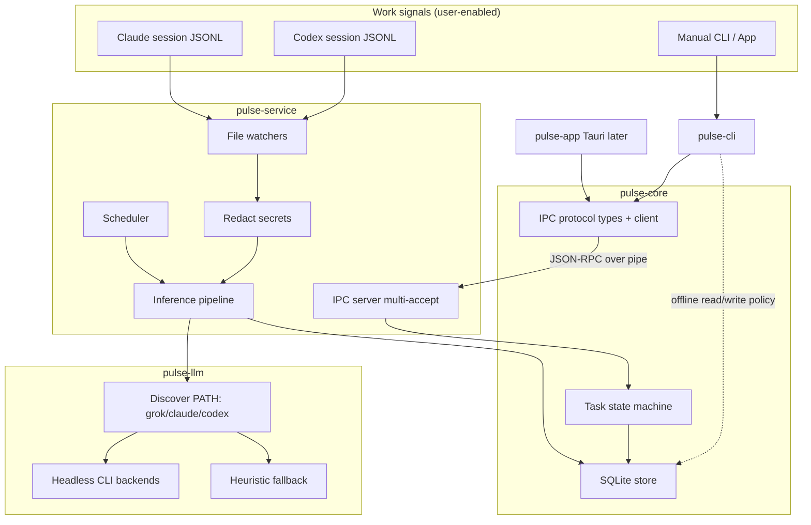
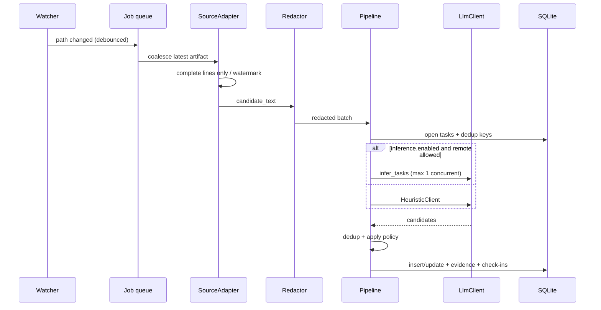

# Pulse MVP Technical Design

| Field | Value |
|---|---|
| **Title** | Pulse MVP Technical Design |
| **Author** | Engineering (implementation owners TBD at kickoff) |
| **Approvers** | TBD before marking Ready for Implementation |
| **Date** | 2026-07-21 |
| **Status** | Ready for Implementation (design review consensus, R3) |
| **Audience** | Senior engineers implementing the greenfield monorepo |
| **Related** | Product PRD (session context); no prior RFCs (greenfield) |
| **Revision** | R5 — local-first activity memory with opt-in CockroachDB and AWS sync |

---

## Overview

**Pulse** is a local-first activity and memory layer for human-AI work. Its
MVP promise is: *a task can continue across agents without the user rebuilding
context by hand.*

This document specifies the original local foundation for v0 (Windows-first): a
Rust Cargo workspace with a background service (`pulse-service`), CLI
(`pulse-cli`), SQLite store (`pulse-core`), source adapters for Claude/Codex
sessions (`pulse-sources`), and **LLM inference by shelling out to whatever
agent CLIs the user already has** (`pulse-llm` discovers `grok`, `claude`, and/or
`codex` on `PATH`), plus a Tauri desktop shell (`pulse-app`).

The current extension preserves that local foundation while adding an activity
graph, checkpoints, reminders, structured agent handoffs, and an explicit
opt-in cloud sync path. Local SQLite remains immediately usable offline; AWS
Lambda persists approved records to CockroachDB and S3 stores approved large
artifacts. Claude, Codex, or another configured local provider performs
inference and summarization—AWS Bedrock is not required. See
[activity-model.md](activity-model.md) and
[implementation-roadmap.md](implementation-roadmap.md) for the authoritative
extension scope.

**Important split:** Claude/Codex **session files** are *work signals* (sources). Claude/Codex/Grok **CLIs** are *inference engines* (how Pulse asks a model for structured task candidates). Same tools, different roles.

The design prioritizes a task-first UX (Inbox → Today/Next/Waiting/Done), evidence-linked inference, offline-capable reads, no Pulse-managed API keys, secret redaction before any CLI-backed remote call, and untrusted treatment of session transcripts.

The local workspace, daemon, CLI, source adapters, agent CLI integration, and
Tauri shell described below are implemented. New activity-memory and cloud-sync
work must extend them incrementally rather than rewrite them.

---

## Background & Motivation

### Problem

Most todo apps are passive: users must remember to create and update tasks, so lists go stale. Monitoring-style tools reverse the problem—they emit noise without a clean task surface. Users need a simple, trustworthy task inbox that stays accurate from real work signals (especially AI coding sessions), without becoming a surveillance product or a full PM suite.

### Current state

- Greenfield monorepo: empty workspace at `D:\own\pulse`.
- Target users already produce rich local artifacts (Claude Code JSONL sessions, Codex rollout transcripts) that encode intent, progress, and completion cues—but nothing currently turns those into triaged todos with evidence.

### Pain points this design addresses

| Pain | Design response |
|---|---|
| Stale todos | Watchers + inference pipeline keep Inbox current |
| Black-box AI | Every inferred task/update carries `Evidence` rows |
| Cloud/sync friction | Local-first SQLite under `%LOCALAPPDATA%\Pulse\` |
| Platform lock-in | Transport trait + path helpers; Windows named pipes first |
| Offline / no agent CLI | Heuristic fallback; Pulse CLI can read SQLite without service |
| Secrets in transcripts | Mandatory redaction before CLI-backed remote LLM; residual risk disclosed |

---

## Goals & Non-Goals

### Goals (MVP)

1. Lightweight Rust background service: watch enabled sources, run inference, schedule daily summaries, expose local IPC.
2. CLI: list/add/done/status transitions, summaries, check-in, export, service control.
3. Task inbox with states: **Inbox, Today, Next, Waiting, Done**.
4. Automatic task inference from **Claude** and **Codex** session files (user-enabled).
5. Status updates from work activity when confidence is high enough; otherwise check-in questions.
6. Daily summary generation via a **discovered agent CLI** (`grok` / `claude` / `codex` headless one-shot), with heuristic template if none available.
7. Manual task management (app later; CLI in earlier PRs).
8. Evidence-linked task entries (snippets, source refs, timestamps).
9. Windows-first delivery with Linux-ready abstractions.

### Non-Goals (MVP)

- Full project management / replace Jira, Linear, Notion.
- Tracking all personal activity or any surveillance posture.
- Broad third-party integrations (calendar, git, app focus, terminal: **design stubs only**).
- Team collaboration, multi-user, or cloud sync by default.
- Telemetry of any kind.
- Shipping Tauri polish before core service + CLI + inference path is solid.
- Soft-delete/archive, multi-task merge (`group_items` check-in), embedding-based dedup.
- Server-push IPC notifications (app polls in MVP).

### MVP acceptance criteria

MVP is **complete** when all of the following pass (manual and/or automated):

1. **Fresh install:** `pulse tasks add "hello"` creates a task in SQLite under `%LOCALAPPDATA%\Pulse\` without a running service.
2. **Service lifecycle:** `pulse service start` → `status` reports healthy → `stop` terminates cleanly via IPC within 10s; no orphan PID claiming live process.
3. **IPC path:** With service up, `pulse tasks list` uses named pipe (not direct DB write for mutations); `ping` p95 &lt; 5 ms on local SSD.
4. **Source gate:** With Claude/Codex disabled, no files under user session dirs are read (assert via test double / audit log).
5. **Heuristic inference:** With sources enabled, no agent CLI on `PATH` (or `llm.provider = "none"`), and fixture JSONL copied to a temp “session” root, service produces ≥1 Inbox task with evidence within 30s of file write; confidence ≤ 0.45.
6. **CLI LLM inference (if backend present):** Same fixture path with a mock/stub backend or real headless CLI produces Inbox task with evidence within 2 minutes; redaction unit tests prove known secret patterns are stripped from the prompt file/stdin **before** the subprocess starts; spawn uses tool-disabled / empty-cwd flags.
7. **Done safeguard:** No automated path can set status Done at confidence &lt; `strong_done_threshold` without a check-in answer.
8. **Check-in loop:** Low-confidence candidate creates open check-in; `pulse checkin answer` applies documented state patch.
9. **Daily summary:** `pulse summary generate` produces a row for local calendar day (heuristic template without backend; LLM prose with CLI backend). Service also auto-attempts once per local day at ~23:55 if no row exists (see Daily summary scheduler).
10. **Export:** `pulse export history --format json` writes a file the user can delete; no network involved.
11. **Backend MVP option:** Criteria 1–10 without Tauri constitute **backend MVP**; PR6 UI is required for **full product MVP** but may be timeboxed after backend.

---

## Proposed Design

### High-level system shape



### Proposed monorepo layout

```text
D:\own\pulse\
  Cargo.toml                 # workspace root
  README.md
  LICENSE
  .gitignore
  rust-toolchain.toml        # pin stable
  crates/
    pulse-core/              # domain + SQLite + state machine + IPC protocol/client types
    pulse-sources/           # Claude/Codex adapters + SourceAdapter trait
    pulse-llm/               # LlmClient + HeuristicClient + CliBackend (grok/claude/codex)
    pulse-service/           # daemon binary: watchers, scheduler, IPC server
    pulse-cli/               # clap CLI binary
  apps/
    pulse-app/               # Tauri shell (PR6+)
  fixtures/
    claude/
    codex/
  docs/
    design/
```

**Workspace members growth (order):**

| PR | Members added |
|---|---|
| PR1 | `pulse-core` |
| PR2 | `pulse-cli` |
| PR3 | `pulse-service` |
| PR4 | `pulse-sources`, `pulse-llm` (HeuristicClient only at first) |
| PR5 | expands `pulse-llm` with CLI backends + discovery |
| PR6 | `apps/pulse-app` (optional for backend MVP) |

```toml
[workspace]
resolver = "2"
members = [
  "crates/pulse-core",
  "crates/pulse-sources",
  "crates/pulse-llm",
  "crates/pulse-service",
  "crates/pulse-cli",
  # "apps/pulse-app",
]
```

### Crate responsibilities

| Crate | Role | Key deps (illustrative) |
|---|---|---|
| `pulse-core` | Models, **additive** migrations, CRUD, state machine, dedup helpers, path helpers, **JSON-RPC protocol types + IPC client helpers**, config load/validate | `rusqlite`, `serde`, `uuid`, `chrono`, `thiserror`, `toml` |
| `pulse-sources` | `SourceAdapter` trait; Claude/Codex discovery + extract; future stubs | `serde_json`, `walkdir`; `notify` optional |
| `pulse-llm` | `LlmClient` trait; `HeuristicClient`; `CliLlmBackend` (`grok`/`claude`/`codex`); discovery; sanitizer; prompts | `tokio::process`, `serde_json`, `regex`, `which` (or manual PATH scan) |
| `pulse-service` | **Binary only:** watchers, inference jobs, scheduler, IPC **server**, logging | `tokio`, `tracing`, `tracing-appender` |
| `pulse-cli` | Binary: clap commands; IPC client from core; store fallback per write policy | `clap`, `serde_json` |
| `pulse-app` | Tauri UI over same IPC client types | Tauri 2.x (later) |

### Dependency direction (hard rule)

```text
pulse-cli  ──► pulse-core   (models, store, IPC client, config)
pulse-app  ──► pulse-core   (IPC client types only; no service crate)

pulse-service (bin) ──► pulse-core
                     ──► pulse-sources
                     ──► pulse-llm

pulse-sources ──► pulse-core   (types only)
pulse-llm     ──► pulse-core   (types only)

# FORBIDDEN:
# pulse-cli  ──► pulse-service   (would pull daemon deps into CLI)
# pulse-core ──► pulse-llm | pulse-sources | network
```

`pulse-core` must not depend on network, filesystem watchers, or UI. Protocol types and a small async/sync IPC **client** live in `pulse-core` (or a later extract `pulse-ipc` after Tauri if compile times hurt). Server accept-loop lives only in `pulse-service`.

**Library error style:** prefer `thiserror` in `pulse-core` public APIs. Trait sketches below that use `anyhow` are **illustrative only**—implement with typed errors (`IpcError`, `StoreError`, `SourceError`).

### Storage roots (Windows v0)

| Path | Purpose |
|---|---|
| `%LOCALAPPDATA%\Pulse\` | Root data directory (created with **user-only DACL** on first run where feasible) |
| `%LOCALAPPDATA%\Pulse\pulse.db` | SQLite system of record |
| `%LOCALAPPDATA%\Pulse\config.toml` | **Runtime settings SoR** (user-editable) |
| `%LOCALAPPDATA%\Pulse\logs\service.log` | Rolling service logs |
| `%LOCALAPPDATA%\Pulse\exports\` | Default export output |
| `%LOCALAPPDATA%\Pulse\service.pid` | PID file (JSON) |
| Named pipe | `\\.\pipe\pulse-service` (v0), **explicit owner-only SD** |

Path helpers live in `pulse-core::paths` with `#[cfg(windows)]` / `#[cfg(unix)]` so Linux can later use `~/.local/share/pulse/` and UDS.

**Directory ACLs:** On first run, create `%LOCALAPPDATA%\Pulse\` with an explicit DACL granting FULL to the current user SID only (no Everyone). Files `pulse.db`, `config.toml`, logs, exports inherit. Document single-user trust boundary: other processes as the same user can still read data.

### Configuration source of truth

**Decision: `config.toml` is the sole SoR for user-facing runtime settings.**

| Store | Role |
|---|---|
| `%LOCALAPPDATA%\Pulse\config.toml` | Enabled sources, thresholds, LLM provider preference, pipe name, log level, inference caps |
| SQLite | Tasks, evidence, activity, summaries, check-ins, watermarks only |
| Environment | **No Pulse-managed API keys.** Agent CLIs use their own auth (OAuth/keychain/env) outside Pulse |
| ~~`settings` table~~ | **Removed from v1 schema** |

**Load rules:**

1. Service loads `config.toml` at start (create defaults if missing).
2. CLI `sources enable|disable` **rewrites** `config.toml` atomically (write temp + rename), then calls IPC `config.reload` if service is up.
3. IPC `sources.set_enabled` / `config.reload` re-reads file; no dual write to DB.
4. Hot-reload: IPC method `config.reload` only (no SIGHUP on Windows). Invalid TOML → keep previous in-memory config + log error; do not crash.
5. CLI and service share `pulse_core::config::load(path) -> Result<Config, ConfigError>` with validation (threshold ranges, known source ids).

### Config sketch (`config.toml`)

```toml
[service]
pipe_name = "pulse-service"
log_level = "info"
# log rotation
log_max_files = 7
log_max_bytes = 10_485_760   # 10 MiB per file

[llm]
# "auto" = first available on PATH from preference[]; "none" = heuristic only
provider = "auto"
preference = ["grok", "claude", "codex"]
timeout_secs = 120             # agent CLIs are slower than direct HTTP
max_concurrent_llm_calls = 1
# optional absolute path overrides (skip PATH lookup)
# grok_bin = ""
# claude_bin = ""
# codex_bin = ""
# optional model override passed through when the backend supports -m/--model
# model = ""

[inference]
enabled = true                 # master switch for auto inference jobs
checkin_threshold = 0.55
auto_status_threshold = 0.75   # non-Done transitions
strong_done_threshold = 0.90
dedup_title_similarity = 0.92
max_candidate_text_bytes = 65536
max_candidates_per_batch = 5
heuristic_inbox_inserts_per_hour = 20
debounce_ms = 2000
max_queued_jobs = 32

[sources.claude]
enabled = false
# extra_roots = []

[sources.codex]
enabled = false

[sync]
# Explicit opt-in. The local database and reminders continue to work offline.
enabled = false
# Required only when enabled. Use http:// only for local development.
# endpoint = "https://<lambda-function-url>/sync"
# Optional archive destination for explicitly approved large artifacts.
# artifact_bucket = "pulse-artifacts"

[privacy]
# residual risk: redaction is best-effort; CLI backends still send prompts
# to the provider behind that CLI (Anthropic / OpenAI / xAI per their auth)
acknowledge_remote_llm = false   # must be true before first CLI-backed call
```

First CLI-backed LLM use requires `acknowledge_remote_llm = true`. Until then, force heuristic-only even if agent CLIs are installed.

`sync.enabled` is separate from the LLM privacy acknowledgement. It queues only
explicitly approved structured activity records for the future sync client;
authentication secrets must not be written to `config.toml`.

**How to set ack (normative, available in PR5 — not only PR7):**

1. `pulse privacy acknowledge` — sets `privacy.acknowledge_remote_llm = true` in `config.toml` (atomic rewrite) and calls `config.reload` if service is up. Prints residual-risk one-liner to stderr (names the selected backend if known).
2. `pulse sources enable <id>` — if a discoverable agent CLI is present **and** ack is still false, interactive prompt: `Pulse will call your installed agent CLI with redacted session excerpts (leaves this machine via that CLI's provider). Type 'yes' to acknowledge:` — on yes, same as (1) before enabling the source; on no/non-TTY, enable source but leave ack false (heuristic-only until `privacy acknowledge`).
3. Hand-edit `config.toml` remains valid (file is SoR).

### Session source discovery (Windows)

Exact layouts can drift; implementers must **probe at implement time** and keep path lists configurable in `config.toml`.

#### Claude Code

| Item | Value |
|---|---|
| Default root | `%USERPROFILE%\.claude\` (override: `CLAUDE_CONFIG_DIR`) |
| Session artifacts | `%USERPROFILE%\.claude\projects\<project-slug>\*.jsonl` |
| Project slug | Path-derived folder for the working directory |
| Secondary (optional) | `%APPDATA%\Claude\` (e.g. `claude-code-sessions`); optional probe only |

#### Codex CLI

| Item | Value |
|---|---|
| Default root | `%USERPROFILE%\.codex\` (override: `CODEX_HOME`) |
| Session artifacts | `%USERPROFILE%\.codex\sessions\YYYY\MM\DD\rollout-*.jsonl` |

#### Discovery algorithm (both)

1. If source disabled → skip entirely (no directory listing).
2. Resolve root via env override else default.
3. Walk known layout for `*.jsonl`.
4. Identity: `(canonical_path, size_bytes, mtime_ms)` in `source_watermarks`.
5. On change: extract as inert text; never execute content.

#### Parser / extraction contract (MVP)

JSONL **record shapes differ and drift**. MVP extraction is **best-effort and version-tolerant**:

1. Read file as UTF-8 (lossy), **complete lines only** (see runtime section).
2. For each JSON object line:
   - If object has common text fields (`message`, `content`, `text`, nested `message.content` string or array of `{type:"text", text}`), concatenate **user/assistant/human** roles preferentially.
   - Prefer **excluding** large `tool_result` / `tool_use` / binary blobs when a role field is present (reduces secret density and noise).
   - If line is not JSON → append raw line text (truncated).
3. Build `candidate_text` as a window of recent turns (tail-biased), capped by `max_candidate_text_bytes`.
4. **Populate `project` and `source_session_id` on every extract** (see Project identity below).
5. Golden fixtures in `fixtures/claude/` and `fixtures/codex/` define expected extracts for PR4; parsers may improve without schema freezes.

#### Project identity from sources (normative)

Inferred tasks must carry a stable project key when the source layout provides one—otherwise title-similarity dedup collapses to entire source.

| Source | `project` value | `source_session_id` |
|---|---|---|
| Claude | Project-slug directory name under `projects/` (e.g. hyphenated path folder) | JSONL basename without extension (or full relative path under projects) |
| Codex | Prefer `cwd` / workspace field from transcript if present; else parent path of the session file under `sessions/` (e.g. `YYYY/MM/DD` is **not** preferred—use cwd when available, else `null`) | `rollout-*.jsonl` basename |
| Manual | User-supplied or null | null |

Adapters expose these on `ExtractedBatch` / `ActivityEventDraft` so the pipeline sets `tasks.project` and `tasks.source_session_id` on create (and may refresh on update if still null).

### Safety (mandatory)

- Session content is **untrusted inert history** (integrity/injection).
- Session content is also **confidentiality-sensitive** (may contain `.env` dumps, tokens from tool output).
- Never pass transcript text to a shell; never interpret as Pulse control instructions.
- Only process sources the user has **explicitly enabled** (default: auto-sources **off**).

### Secret redaction before CLI-backed LLM (mandatory)

Before writing the prompt that will be passed to any agent CLI, run `pulse_llm::sanitize::redact_for_remote(text) -> RedactedText`:

| Rule | Behavior |
|---|---|
| High-entropy tokens | Redact strings ≥ 24 chars matching `[A-Za-z0-9_\-+/=]{24,}` when adjacent to key-like context |
| Assignment patterns | `API_KEY=`, `api_key:`, `secret=`, `password=`, `token=` → value replaced with `[REDACTED]` |
| Bearer / headers | `Bearer <token>`, `x-api-key: …` |
| PEM blocks | `-----BEGIN … PRIVATE KEY-----` through `END` |
| Cloud key shapes | AWS `AKIA…`, `sk-…`, `ghp_…`, `xai-…` style prefixes (best-effort regex) |
| Path denylist snippets | Lines containing `\.env`, `credentials.json`, `id_rsa` content markers → drop or heavy redact |
| Prefer structured summaries | Adapters should prefer user/assistant text over raw tool payloads (see extraction) |

**Residual risk (document in UX):** Redaction is **best-effort**, not formal DLP. CLI backends still send the redacted prompt to whatever provider that CLI is logged into. User must set `privacy.acknowledge_remote_llm = true`. Heuristic mode never leaves the machine and never spawns agent CLIs.

**Local evidence snippets** stored in SQLite are also redacted with the same function when derived from session text (avoid persisting raw secrets on disk when easy to strip).

### Inference pipeline



**Pipeline steps (normative):**

1. **Watch** — Prefer `notify`; **poll fallback every 30s** required on Windows (editor/AV locks, missed events).
2. **Debounce** — Per-file coalesce window `debounce_ms` (default 2000). Multiple events → one job with latest watermark intent.
3. **Queue** — Global FIFO, `max_queued_jobs` (default 32). Same `source_ref` already queued → **replace** with newer job (coalesce). If full → drop oldest non-running job and log warn (backpressure).
4. **Extract** — Complete lines only; watermark `byte_offset` after last full `\n`.
5. **Shrink/rotate** — If `size_bytes < watermark.size_bytes` OR path identity changed (path deleted/recreated) → reset `byte_offset` to 0; full re-extract; rely on dedup for tasks.
6. **Sanitize** — Always before remote LLM; also before persisting evidence snippets from sessions.
7. **Infer** — `LlmClient` or heuristic → candidates.
8. **Dedup** — See Dedup section.
9. **Insert/update** — Apply create-vs-promote and auto-status policy (below); create check-ins when required.
10. **LLM concurrency** — `max_concurrent_llm_calls = 1` for MVP; timeout `timeout_secs` (default 45).

### Dedup identity

| Mechanism | Definition |
|---|---|
| `dedup_key` | `sha256_hex(source_id \|\| ":" \|\| stable_session_id \|\| ":" \|\| candidate_fingerprint)` where `stable_session_id` is artifact basename or path-stable id, and `candidate_fingerprint` is normalized title (lowercase, collapse whitespace, strip punctuation) truncated to 80 chars **or** LLM-provided stable id if present |
| When set | On every inferred create; manual tasks leave `dedup_key` NULL |
| DB | `UNIQUE` index on `dedup_key` **where not null** (partial unique index) |
| Exact hit | Same `dedup_key` → **update existing** open task (refresh evidence, maybe status per policy); do not insert duplicate |
| Title similarity | Normalized title similarity ≥ `dedup_title_similarity` (0.92), candidate set restricted to open tasks with **same `source`**, and: (1) if either side has non-null `project`, require equal `project`; (2) if both `project` null, require equal non-null `source_session_id`; (3) if project and session both null on either side, **do not** title-merge (exact `dedup_key` / `match_task_id` only). Never merge across sources. |
| `match_task_id` | If LLM returns it and task exists and is open → treat as update path; ignore if Done or unknown id |
| Races | Insert uses `INSERT … ON CONFLICT(dedup_key) DO UPDATE` (or select-then-update in one SQLite write transaction). Inference jobs that touch tasks run under a single pipeline mutex for MVP (in addition to max 1 LLM call) |

### Auto status transition policy (normative)

#### Create vs promote (locked — no same-batch promote)

**On create (new task row):** always insert `status = Inbox`. **Ignore** `proposed_status` for that insert, even if confidence ≥ `auto_status_threshold`. User triage from Inbox is the trust surface.

**Auto non-Done / Done transitions** apply only to tasks that **already existed in the DB before this inference job started** (snapshot open-task ids at job start). Optionally implemented as a dedicated status-update pass after creates in the same job, still only over pre-existing ids.

**`proposed_status` on a create candidate:** may be stored as a suggestion in `notes` or ignored; must **not** change the inserted status away from Inbox in the same job.

| Proposed transition | Confidence | Action |
|---|---|---|
| *(create)* → Inbox | any accepted candidate | Auto-create **Inbox only**; ignore `proposed_status` on insert |
| **pre-existing** any → Done | ≥ `strong_done_threshold` (0.90) | Auto-apply Done + `completed_at` |
| **pre-existing** any → Done | &lt; 0.90 | Create check-in `is_done` (do **not** apply) |
| **pre-existing** among {Inbox, Today, Next, Waiting} ↔ {Today, Next, Waiting} | ≥ `auto_status_threshold` (0.75) | Auto-apply |
| **pre-existing** among {Inbox, Today, Next, Waiting} ↔ {Today, Next, Waiting} | ≥ `checkin_threshold` and &lt; 0.75 | Check-in `still_active` / status suggestion; no auto |
| **pre-existing** status proposal below `checkin_threshold` | — | **Ignore** (no status change, no check-in for status) |
| Done → * | any auto | **Never** auto; user reopen only (Done→Inbox) |
| notes / `suggested_next_action` on **pre-existing** | ≥ `checkin_threshold` | May auto-update without status change |
| notes / `suggested_next_action` | &lt; checkin_threshold | Skip field updates |
| **Low-confidence create** | any accepted create | Always insert Inbox; **no companion check-in on create in MVP** — user triages Inbox. (Check-ins are for status uncertainty on pre-existing tasks or explicit `is_done` proposals.) |

Invalid transitions (e.g. Done→Today) are **rejected** by the state machine for both IPC and pipeline.

### Allowed transition matrix

| From \ To | Inbox | Today | Next | Waiting | Done |
|---|---|---|---|---|---|
| Inbox | — | ✓ | ✓ | ✓ | ✓ |
| Today | ✓ | — | ✓ | ✓ | ✓ |
| Next | ✓ | ✓ | — | ✓ | ✓ |
| Waiting | ✓ | ✓ | ✓ | — | ✓ |
| Done | ✓ (reopen) | ✗ | ✗ | ✗ | — |

### Heuristic fallback (no agent CLI, no ack, or LLM error)

1. Keyword/pattern scan on redacted deltas: `TODO`, `FIXME`, checklist `- [ ]`, limited verbs—but **require** line looks task-like (min title length **12** chars after cleanup).
2. Confidence caps: new ≤ 0.45; Done proposals ≤ 0.40 (always check-in for Done).
3. **Spam control:** `heuristic_inbox_inserts_per_hour` (default 20); `max_candidates_per_batch` (5); skip lines matching pure code/import noise heuristics.
4. Daily summary: template bullets only.
5. Log `warn` once per hour when in heuristic mode due to missing agent CLI or missing privacy ack.

### LLM parse / failure contract

1. Prefer CLI-native **structured output** when available (`grok --json-schema`, Claude/Codex JSON print modes); else ask for JSON-only in the prompt and validate against Appendix B.
2. Else: strip fences; extract first top-level JSON object.
3. `serde` validate against Appendix B schema.
4. On failure: **one** retry with “return valid JSON only” repair prompt.
5. Still failing → fall back to `HeuristicClient` for that batch; log error (no panic).
6. Truncated JSON → treat as failure.
7. `max_tokens` from config; per-request timeout; no unbounded retries.
8. Cost: no hard $ budget in MVP (usage billed via user’s existing CLI subscriptions); rely on max concurrent 1 + debounce + batch caps + kill-on-timeout.

### Check-in kinds and answer → state rules

**MVP kinds:** `still_active`, `is_done`, `next_step`.  
**Deferred post-MVP:** `group_items` (multi-task merge UX).

#### Answer schemas

```json
// still_active
{ "active": true, "status"?: "Today"|"Next"|"Waiting" }
// active=false → suggest Done via follow-up or set Waiting

// is_done
{ "done": true } | { "done": false, "status"?: "Today"|"Next"|"Waiting" }

// next_step
{ "next_action": "string", "status"?: "Today"|"Next"|"Waiting" }
```

CLI may accept shorthand: `yes`/`no` mapped per kind.

#### `apply_checkin_answer` (pure, in `pulse-core`)

| Kind | Answer | TaskPatch |
|---|---|---|
| `is_done` | `done=true` | `status=Done`, `completed_at=now` |
| `is_done` | `done=false` | `status=answer.status.unwrap_or(Today)` |
| `still_active` | `active=true` | `status=answer.status.unwrap_or(Today)` |
| `still_active` | `active=false` | `status=Waiting` (user can Done separately) |
| `next_step` | | `suggested_next_action=next_action`; optional status |

Mark check-in `answered`; attach evidence kind `checkin_answer`.

### Daily summary scheduler (normative)

| Path | Behavior |
|---|---|
| **On-demand** | CLI `pulse summary generate` / IPC `summary.generate` always available (acceptance criterion 9). |
| **Automatic (MVP)** | Service schedules **one attempt per local calendar day at 23:55 local** (or on the next service wake after that time if the process was asleep/stopped). If a `summaries` row already exists for that local `day`, skip. If LLM unavailable, write heuristic template summary. |
| **Not in MVP** | Multiple daily runs, user-configurable schedule UI, midnight-only triggers without the 23:55 catch-up. |

Scheduler is a lightweight Tokio timer in `pulse-service`, not Windows Task Scheduler (autostart is separate).

### Watcher / watermark edge cases

| Case | Behavior |
|---|---|
| Partial last line | Do not parse; leave `byte_offset` at previous full line end |
| File shrink / truncate | Reset offset 0; re-extract; dedup protects tasks |
| File deleted | Drop watermark optional; ignore until recreated |
| Rapid appends | Debounce + coalesce per `source_ref` |
| Offline queue growth | Cap `max_queued_jobs`; drop oldest coalesced |

### Windows process management

#### PID file format (`service.pid`)

```json
{
  "pid": 12345,
  "started_at": "2026-07-21T15:00:00Z",
  "exe_path": "C:\\...\\pulse-service.exe",
  "pipe_name": "pulse-service"
}
```

- Write: create `service.pid.tmp` → write → `fsync` → atomic rename to `service.pid`.
- **Live check:** OpenProcess / `Get-Process` equivalent; if PID not running → treat PID file **stale**, delete, allow start.
- **Stale:** missing process OR `exe_path` does not match expected binary (warn).

#### `pulse service run`

Normative lifecycle order:

1. Load and validate `config.toml` (create defaults if missing).
2. Open DB; apply migrations (before accepting IPC).
3. Bind named pipe with explicit owner-only SD + `PIPE_REJECT_REMOTE_CLIENTS`. On bind failure → exit non-zero; **do not** write PID.
4. **After successful bind:** write `service.pid` (atomic rename) with `pid`, `started_at`, `exe_path`, `pipe_name` for **this** process — this is how `start` / `status` / offline write policy detect a live service (including `schtasks` → `run --quiet`).
5. Enter accept loop + watchers/scheduler.
6. Foreground; handle Ctrl+C / `service.shutdown`.
7. On graceful exit: flush, close pipe, **remove `service.pid` only if file contents match this process** (pid + exe_path). On failed bind or pre-PID failure: never leave a PID file for this attempt.

#### `pulse service start`

- If live PID + pipe healthy → error “already running”.
- If live PID + pipe dead → refuse; print recovery (`stop --force` or delete stale after process check).
- Spawn `pulse-service run --quiet` with:
  - Windows: `CREATE_NEW_PROCESS_GROUP`, detached stdio (null or log file), working directory = data root, **inherit user environment** (so agent CLIs can use their existing login/keychain/env auth — Pulse does not inject API keys).
  - Do not strip user env.
- **Wait for ready (normative):** poll until `service.pid` is live for the child **and** IPC `ping` succeeds, or fail after **15s** timeout (kill orphan child if PID written but ping never succeeds; clean stale PID). Return OK only when ping succeeds.

#### `pulse service stop`

1. Connect IPC → `service.shutdown` (graceful: finish in-flight job ≤ timeout, flush DB, remove PID).
2. Wait up to **10s**.
3. If still alive → terminate process (last resort); remove PID if process gone.
4. Never kill during schema migration: migrations run at start before accepting IPC; shutdown handler does not start migrations.

#### Autostart

```text
schtasks /Create /TN "PulseService" /SC ONLOGON /RL LIMITED ^
  /TR "\"C:\Path\To\pulse-service.exe\" run --quiet" /F
```

`install-autostart` resolves current exe path; `uninstall-autostart` deletes task `PulseService`. Limited rights (not highest). Document that Task Scheduler may not have the same interactive-session environment as a logged-in terminal—agent CLIs that require interactive OAuth may not work under schtasks until the user has machine-level credentials; surface this in `pulse llm status` / logs.

#### Logging

- `tracing` + `tracing-appender` rolling: `log_max_bytes`, `log_max_files`.
- Never log full pre-redaction transcripts at info; debug snippets ≤ 200 chars **after** redaction; never log agent CLI auth tokens if they appear in stderr.

### IPC protocol

**Choice: JSON-RPC 2.0 over length-prefixed frames on a local transport.**

#### Framing

```text
u32 little-endian length | UTF-8 JSON body
```

Max frame: **4 MiB**.

#### Multi-client model (normative)

- Server **accept loop** supports **N concurrent connections** (Windows: `PIPE_UNLIMITED_INSTANCES` or high instance count; each client ConnectNamedPipe → spawn task).
- Each connection: synchronous request/response only (read frame → handle → write frame).
- **MVP: no server push.** Methods `tasks.changed` notifications are **post-MVP**.
- Tauri/CLI refresh via **poll** (`tasks.list` every 2–5s when UI focused, or on user action). Optional later: `subscribe` + notifications.

#### Pipe security (normative — do not rely on defaults)

Windows named pipe **must** be created with:

1. **Explicit SECURITY_ATTRIBUTES** DACL: current user SID `GENERIC_ALL` only; **no** Everyone, **no** anonymous.
2. **`PIPE_REJECT_REMOTE_CLIENTS`** so remote `\\server\pipe\...` is rejected.
3. Local only; **never** TCP bind in MVP.
4. Document: elevated vs non-elevated processes are different tokens—CLI and service should run at same integrity level (normal user). If elevation mismatch prevents connect, error message explains.

#### Transport trait (illustrative)

```rust
// Sketches are illustrative; prefer thiserror in pulse-core library APIs.
// Avoid anyhow in public library traits.

#[async_trait]
pub trait IpcTransport: Send + Sync {
    async fn serve<H>(self, handler: H) -> Result<(), IpcError>
    where
        H: IpcHandler + Send + Sync + 'static;

    async fn connect(endpoint: &IpcEndpoint) -> Result<IpcClient, IpcError>;
}

#[async_trait]
pub trait IpcHandler: Send + Sync {
    async fn handle(&self, method: &str, params: serde_json::Value) -> Result<serde_json::Value, IpcError>;
}

pub enum IpcEndpoint {
    NamedPipe(String),
    UnixSocket(std::path::PathBuf), // future
}
```

#### Offline / concurrent write policy (locked)

| Step | Rule |
|---|---|
| 1 | If named pipe **connect succeeds** → **all writes and reads prefer IPC** (mutations always IPC). |
| 2 | If connect fails **and** PID file missing **or** PID stale (process not running) → allow **direct SQLite** read/write with stderr warning once per command. |
| 3 | If PID file **live** (process exists) **but** pipe connect fails → **refuse writes**; print recovery (`pulse service stop` / `--force` / check logs). Reads may attempt read-only DB open. |
| 4 | Never run inference in CLI; service only. |

This is a **Key Decision**—no dual “or” paths for implementers.

#### Methods (JSON-RPC)

| Method | Params (summary) | Result |
|---|---|---|
| `ping` | `{}` | `{ "ok": true, "version": "0.1.0" }` |
| `config.reload` | `{}` | `{ "ok": true }` or error if invalid file |
| `tasks.list` | `{ "status"?: [...], "limit"?: n, "offset"?: n }` | `{ "tasks": Task[] }` |
| `tasks.get` | `{ "id": uuid }` | `{ "task": Task, "evidence": Evidence[] }` |
| `tasks.create` | `{ "title", "status"?: "Inbox"\|"Today", "notes"? }` | `{ "task": Task }` |
| `tasks.update` | `{ "id", "title"?, "status"?, "notes"?, "project"? }` | `{ "task": Task }` |
| `tasks.done` | `{ "id" }` | `{ "task": Task }` |
| `summary.generate` | `{ "date"?: "YYYY-MM-DD" }` | `{ "summary": Summary }` |
| `summary.get` | `{ "date": "YYYY-MM-DD" }` | `{ "summary": Summary \| null }` |
| `checkin.list` | `{ "open_only"?: true }` | `{ "items": CheckIn[] }` |
| `checkin.answer` | `{ "id", "answer": object }` | `{ "ok": true, "task"?: Task }` |
| `export.history` | `{ "from"?, "to"?, "format": "json"\|"md" }` | `{ "path": string }` |
| `sources.list` | `{}` | `{ "sources": SourceStatus[] }` |
| `sources.set_enabled` | `{ "id": "claude"\|"codex", "enabled": bool }` | `{ "ok": true }` — persists via config.toml rewrite |
| `service.shutdown` | `{}` | `{ "ok": true }` |
| `service.status` | `{}` | health, version, pid, llm_mode, queue_depth |
| `activity.list` | `{ "limit"?, "task_id"? }` | `{ "events": ActivityEvent[] }` |

**No `tasks.delete` in MVP** — complete with Done only. Hard delete post-MVP.

#### JSON-RPC error model

| Code | Name | When |
|---|---|---|
| -32700 | ParseError | Invalid JSON |
| -32600 | InvalidRequest | Not JSON-RPC shape |
| -32601 | MethodNotFound | Unknown method |
| -32602 | InvalidParams | Schema / validation |
| -32603 | InternalError | Unexpected |
| -32001 | TaskNotFound | Unknown task id |
| -32002 | InvalidTransition | State machine reject |
| -32003 | CheckInNotFound | |
| -32004 | ServiceBusy | Queue saturated (rare) |
| -32005 | ConfigError | Invalid config on reload |
| -32006 | Unavailable | Inference/LLM temporarily down (optional) |

CLI mapping: `-32001/-32002/-32602` → exit 1; connect failures when PID live → exit 2; DB errors → exit 3.

#### Wire types (full Task)

```json
{
  "id": "uuid",
  "title": "string",
  "status": "Inbox|Today|Next|Waiting|Done",
  "source": "manual|claude|codex|unknown",
  "confidence": 0.0,
  "project": "string|null",
  "notes": "string|null",
  "suggested_next_action": "string|null",
  "dedup_key": "string|null",
  "source_session_id": "string|null",
  "created_at": "RFC3339",
  "updated_at": "RFC3339",
  "completed_at": "RFC3339|null"
}
```

Evidence / CheckIn similarly include all domain fields (id, foreign keys, kind, status, timestamps, answer_json).

### SourceAdapter trait sketch

```rust
#[async_trait]
pub trait SourceAdapter: Send + Sync {
    fn id(&self) -> SourceId;
    fn capabilities(&self) -> SourceCapabilities;

    async fn discover(&self) -> Result<Vec<DiscoveredArtifact>, SourceError>;

    async fn extract(
        &self,
        artifact: &DiscoveredArtifact,
        since_offset: Option<u64>,
    ) -> Result<ExtractedBatch, SourceError>;
}
```

### LlmClient trait sketch

```rust
#[async_trait]
pub trait LlmClient: Send + Sync {
    fn backend_id(&self) -> &str; // "heuristic" | "grok" | "claude" | "codex"
    async fn infer_tasks(&self, req: InferRequest) -> Result<Vec<TaskCandidateOut>, LlmError>;
    async fn summarize_day(&self, req: SummaryRequest) -> Result<SummaryOut, LlmError>;
}

pub struct HeuristicClient;
pub struct CliLlmClient { backend: CliBackendKind, bin: PathBuf, /* timeouts, schema */ }

#[derive(Clone, Copy)]
pub enum CliBackendKind { Grok, Claude, Codex }

/// Resolve which LlmClient to use for this process/config.
pub fn resolve_llm_client(cfg: &LlmConfig) -> Box<dyn LlmClient> { /* ... */ }
```

#### Discovery (`resolve_llm_client`)

1. If `provider = "none"` → `HeuristicClient`.
2. If `provider` is a concrete name → resolve that binary only; if missing → log + `HeuristicClient`.
3. If `provider = "auto"` → walk `preference[]` in order; first binary found wins.
4. Binary resolution: config override path if set, else `PATH` lookup (`which` crate or Windows `where`-equivalent). On this developer machine (2026-07-21 probe): `claude` → `%USERPROFILE%\.local\bin\claude.exe`, `codex` → npm shim, `grok` → `%USERPROFILE%\.grok\bin\grok.exe` — paths vary; do not hardcode.
5. Re-resolve on `config.reload` and on service start (not every job, unless last spawn returned "binary not found").

#### Headless invoke contracts (normative — tool-disabled)

Agent CLIs can edit repos. Pulse **must** invoke them as pure completion tools:

| Backend | Headless shape (probe at implement time; adjust flags if CLI drifts) | Safety flags |
|---|---|---|
| **grok** | `grok -p <prompt>` or `--prompt-file <path>`; prefer `--json-schema <schema>` + `--output-format json` | `--disallowed-tools` for all write/shell tools if available; else `--permission-mode dontAsk` + empty allow-list; **cwd = empty temp dir** |
| **claude** | `claude -p <prompt>` (`--print`); prefer JSON output format flags when available | Deny tools via `--disallowedTools` / empty `--allowedTools`; prefer modes that do not load project hooks when feasible; **cwd = empty temp dir** |
| **codex** | `codex exec` with prompt arg or stdin | Sandbox / read-only overrides via `-c` when available; **no** full workspace write; **cwd = empty temp dir** |

Shared spawn rules:

- Write redacted prompt to a **temp file under `%LOCALAPPDATA%\Pulse\tmp\`** (or OS temp) when large; never log full prompt at info.
- `timeout_secs` kills the process tree (Windows Job Object preferred).
- `max_concurrent_llm_calls = 1` global mutex (same as before).
- Parse stdout as JSON per Appendix B schema; on parse failure, one retry with a “fix JSON only” wrapper prompt; then fail job → heuristic optional.
- Capture stderr to debug log (truncated); never treat stderr as model output.
- Exit non-zero → `LlmError::Backend`; do not crash service.
- **Do not** pass `--dangerously-skip-permissions` / `--always-approve` / equivalent unless the allow-list is proven empty (prefer hard deny).

Production path: **CLI backends + heuristic fallback**. No Pulse-held API keys; no direct `reqwest` to model providers in MVP.

---

## API / Interface Changes

Greenfield — no prior public API.

### CLI command list

```text
pulse
  tasks
    list [--status inbox|today|next|waiting|done] [--json]
    show <id>
    add <title> [--today] [--notes ...]
    done <id>
    update <id> [--title] [--status] [--notes]
    move <id> <status>
  summary
    generate [--date YYYY-MM-DD]
    show [--date YYYY-MM-DD]
  checkin
    list
    answer <id> <response-json-or-shorthand>
  export
    history [--from] [--to] [--format json|md] [--out path]
  sources
    list
    enable <claude|codex>    # writes config.toml; reloads service if up;
                             # prompts for privacy ack if agent CLI present and not yet acked
    disable <claude|codex>
  llm
    status                   # which backend resolved (or heuristic); path; preference
  privacy
    acknowledge              # set privacy.acknowledge_remote_llm=true; reload if up
  config
    show
    path
    reload                   # IPC if up
  service
    run [--quiet]
    start
    stop [--force]
    status
    install-autostart
    uninstall-autostart
  activity
    list [--limit N] [--task <id>]
  version
```

**Exit codes:** `0` ok, `1` user/logic error, `2` service unreachable when required (live PID / pipe dead), `3` DB error.

---

## Data Model Changes

### Domain types (logical)

**Task:** id, title, status ∈ {Inbox, Today, Next, Waiting, Done}, source, confidence (null manual), project, notes, suggested_next_action, **dedup_key**, **source_session_id**, created_at, updated_at, completed_at.

**Evidence:** id, task_id, kind, source_ref, snippet, metadata_json, observed_at.

**ActivityEvent:** id, source, kind, raw_ref, payload_json, observed_at, task_id?.

**Summary:** id, day (local calendar date string), text, highlights_json, evidence_json, created_at, **timezone_offset_minutes** at creation.

**CheckIn:** id, task_id?, question, kind ∈ {still_active, is_done, next_step}, status open/answered, answer_json, created_at, answered_at.

### SQLite schema (v1)

```sql
-- migrations/001_init.sql
-- MVP migrations are ADDITIVE ONLY after this baseline.

PRAGMA foreign_keys = ON;
PRAGMA journal_mode = WAL;

CREATE TABLE schema_migrations (
  version INTEGER PRIMARY KEY,
  applied_at TEXT NOT NULL
);

CREATE TABLE tasks (
  id TEXT PRIMARY KEY,
  title TEXT NOT NULL,
  status TEXT NOT NULL CHECK (status IN ('Inbox','Today','Next','Waiting','Done')),
  source TEXT NOT NULL CHECK (source IN ('manual','claude','codex','unknown')),
  confidence REAL CHECK (confidence IS NULL OR (confidence >= 0 AND confidence <= 1)),
  project TEXT,
  notes TEXT,
  suggested_next_action TEXT,
  dedup_key TEXT,
  source_session_id TEXT,
  created_at TEXT NOT NULL,
  updated_at TEXT NOT NULL,
  completed_at TEXT
);

CREATE INDEX idx_tasks_status ON tasks(status);
CREATE INDEX idx_tasks_updated ON tasks(updated_at);
CREATE INDEX idx_tasks_project ON tasks(project);
CREATE UNIQUE INDEX idx_tasks_dedup_unique ON tasks(dedup_key) WHERE dedup_key IS NOT NULL;

CREATE TABLE evidence (
  id TEXT PRIMARY KEY,
  task_id TEXT NOT NULL REFERENCES tasks(id) ON DELETE CASCADE,
  kind TEXT NOT NULL,
  source_ref TEXT NOT NULL,
  snippet TEXT,
  metadata_json TEXT,
  observed_at TEXT NOT NULL
);

CREATE INDEX idx_evidence_task ON evidence(task_id);
CREATE INDEX idx_evidence_source_ref ON evidence(source_ref);

CREATE TABLE activity_events (
  id TEXT PRIMARY KEY,
  source TEXT NOT NULL,
  kind TEXT NOT NULL,
  raw_ref TEXT NOT NULL,
  payload_json TEXT,
  observed_at TEXT NOT NULL,
  task_id TEXT REFERENCES tasks(id) ON DELETE SET NULL
);

CREATE INDEX idx_activity_observed ON activity_events(observed_at);
CREATE INDEX idx_activity_task ON activity_events(task_id);

CREATE TABLE summaries (
  id TEXT PRIMARY KEY,
  day TEXT NOT NULL UNIQUE,              -- local calendar date YYYY-MM-DD
  timezone_offset_minutes INTEGER NOT NULL,
  text TEXT NOT NULL,
  highlights_json TEXT NOT NULL DEFAULT '[]',
  evidence_json TEXT NOT NULL DEFAULT '[]',
  created_at TEXT NOT NULL
);

CREATE TABLE checkins (
  id TEXT PRIMARY KEY,
  task_id TEXT REFERENCES tasks(id) ON DELETE CASCADE,
  question TEXT NOT NULL,
  kind TEXT NOT NULL CHECK (kind IN ('still_active','is_done','next_step')),
  status TEXT NOT NULL CHECK (status IN ('open','answered')) DEFAULT 'open',
  answer_json TEXT,
  created_at TEXT NOT NULL,
  answered_at TEXT
);

CREATE INDEX idx_checkins_open ON checkins(status);

CREATE TABLE source_watermarks (
  source_ref TEXT PRIMARY KEY,
  path TEXT NOT NULL,
  size_bytes INTEGER NOT NULL,
  mtime_ms INTEGER NOT NULL,
  byte_offset INTEGER NOT NULL DEFAULT 0,
  last_processed_at TEXT NOT NULL
);

-- No settings table: config.toml is SoR for user settings.
```

### Timezone decision

**Daily summaries and “day” filters use the local OS calendar date.** Store `summaries.day` as `YYYY-MM-DD` local and `timezone_offset_minutes` at creation for audit. Timestamps on tasks remain UTC RFC3339.

### Migration strategy

- Embed SQL via `include_str!`; apply transactionally.
- **MVP: additive-only migrations** after `001_init` (add columns/tables/indexes; no destructive rewrites).
- New binary refuses start if DB `schema_migrations` version is **newer** than binary (forward-only fail-closed).
- Older binary on newer DB: unsupported; user keeps matching binary. Additive columns remain readable by older code only if ignored—document “don’t run old binary on new schema.”

### Retention

90-day activity retention is **intent only** for MVP. No purge job in MVP (post-MVP). Schema/comments must not claim an implemented purge.

### Storage size & performance targets (single-user local)

| Metric | Target |
|---|---|
| Active open tasks | &lt; 500 typical; support 5_000 |
| DB size year-one heavy user | &lt; 200 MB (snippets capped) |
| `tasks.list` latency | p95 &lt; 50 ms for 1_000 rows |
| IPC `ping` | p95 &lt; 5 ms |
| Inference after file change | start after debounce; LLM budget ≤ 45–60s timeout |
| Heuristic inference | &lt; 200 ms for 64 KiB text |
| Memory (service idle) | &lt; 50 MB RSS goal |
| Snippet cap per evidence | 2 KiB |
| Candidate text per LLM call | ≤ 64 KiB |

---

## Alternatives Considered

### 1. Electron desktop + Node service instead of Rust/Tauri

| Pros | Cons |
|---|---|
| Faster UI iteration | Heavier memory; weaker always-on watcher |

**Decision:** Reject for MVP core. Rust service + later Tauri.

### 2. Direct DB access only (no IPC / no daemon)

| Pros | Cons |
|---|---|
| Simpler | No continuous watching; multi-writer races |

**Decision:** Reject as primary shape; hybrid offline policy locked above.

### 3. Cloud-hosted inference + sync backend

**Decision:** Reject cloud-hosted inference. Pulse uses the **user's
already-installed agent CLIs** (or local heuristics) for inference. An opt-in,
minimal AWS sync backend is accepted for durable CockroachDB memory and approved
artifact archival; it must never block local task operations or reminders.

### 4. Custom binary IPC vs JSON-RPC

**Decision:** JSON-RPC 2.0 + length prefix for debuggability.

### 5. `rusqlite` vs `sqlx` (SQLite)

| | rusqlite | sqlx |
|---|---|---|
| Fit | Sync API, simple migrations, small dep graph | Async-first, compile-time SQL |
| MVP time | **Wins** — store behind short blocking pool or `spawn_blocking` | Extra setup for little gain single-user |

**Decision:** **`rusqlite` + embedded SQL migrations** for PR1 speed.

### 6. `notify` vs poll-only (Windows)

| | notify | poll |
|---|---|---|
| Latency | Better when events fire | 30s worst-case |
| Reliability | Misses under locks/AV | Predictable |

**Decision:** **notify + 30s poll fallback** both required on Windows.

### 7. User-mode process vs Windows Service (SCM)

| | User-mode + schtasks | SCM Service |
|---|---|---|
| Complexity | Low | High (session 0, env, debugging) |
| User key env | Natural | Awkward |

**Decision:** **User-mode daemon**; optional logon Task Scheduler. Defer SCM.

### 8. Direct provider HTTP API vs agent CLI backends vs local small model

| | Direct HTTP (xAI/OpenAI/…) | Agent CLIs on PATH | Bundled local model |
|---|---|---|---|
| Auth | Pulse holds API key | Reuse existing CLI login | None / local |
| Ops | Stable SDK shape | Flag drift; subprocess cost | Size + quality |
| Trust | Pulse-owned HTTP | Same providers, via tools user already trusts | Fully local |

**Decision:** **Agent CLI backends** (`grok` / `claude` / `codex` discovery) + **heuristic** local fallback. No Pulse-managed API keys; no bundled local LLM in MVP. Optional direct HTTP can be revisited post-MVP if CLI subprocess cost or non-interactive auth under schtasks becomes a blocker.

### 9. Embedding dedup vs string similarity

**Decision:** **String similarity + dedup_key** only. Embeddings add model/deps without clear MVP ROI.

---

## Security & Privacy Considerations

### Threat model (MVP)

| Threat | Severity | Mitigation |
|---|---|---|
| Secrets in session files sent via agent CLI to a cloud provider | **Critical** | Mandatory redaction; prefer non-tool text; `acknowledge_remote_llm`; residual risk in UX |
| Prompt injection from transcripts | **High** | Inert data framing; JSON-only outputs; **tool-disabled** CLI spawn + empty temp cwd |
| Named pipe open defaults / remote clients | **High** | Explicit owner-only DACL; `PIPE_REJECT_REMOTE_CLIENTS` |
| Agent CLI acting as full coding agent (edits disk) | **High** | Headless one-shot only; deny tools; empty cwd; kill on timeout |
| Pulse-held API key leakage | **N/A (MVP)** | Pulse stores no model API keys |
| Malicious same-user process reading DB | **Medium** | User-only directory DACL; single-user trust boundary documented |
| Cross-user IPC | **Low** (after ACL fix) | Owner-only SD |
| Path traversal in session roots | **Med** | Canonicalize; stay under configured roots |
| Export/logs leaking secrets | **Med** | Redact evidence; no pre-redaction transcripts in logs |

### Privacy principles

- Default data under `%LOCALAPPDATA%\Pulse\` with user-only ACL on create.
- User-controlled sources (default off).
- No telemetry.
- Export user-initiated.
- Transcripts = untrusted + confidential until redacted for remote use.

---

## Observability

| Signal | Approach |
|---|---|
| Logging | `tracing` + rolling file (`tracing-appender`) |
| Metrics | In-memory counters via `service.status`: files_seen, inferences, llm_errors, ipc_calls, queue_depth |
| Correlation | `job_id` UUID in log spans per inference job (not a DB table in MVP) |
| Privacy | No secrets; debug snippets redacted ≤ 200 chars |

---

## Rollout Plan

### Feature flags / config gates

- `sources.*.enabled` (default false).
- `inference.enabled` master switch.
- CLI-backed LLM only if a backend is resolved **and** `acknowledge_remote_llm`.
- Autostart opt-in.

### Staged delivery

See PR Plan. Backend MVP = through PR5 (+ CLI check-ins). Full MVP adds PR6–PR7.

### Rollback

- Additive migrations only.
- Feature flags keep half-built paths inert.
- Disable sources / stop service without uninstall.

### Risks

| Risk | Severity | Mitigation |
|---|---|---|
| Secret leakage via agent CLI | Critical | Redaction + ack + residual disclosure |
| Session path drift | Med | Configurable roots + fixtures |
| Inbox spam (heuristic) | Med | Hourly caps, min title length, dedup |
| Dual-writer races | Med | Locked write policy + pipeline mutex |
| Pipe ACL mistakes | High | Explicit SD + tests |
| PR6 UI balloon | Med | Backend MVP shippable without Tauri; split shell/list |

---

## Testing Strategy

| Layer | Scope | Approach |
|---|---|---|
| Unit core | State machine matrix, dedup_key, check-in apply, config validate | `cargo test` |
| Unit llm | Redaction corpus, heuristic caps, JSON parse/repair | fixtures |
| Unit sources | Golden extracts from `fixtures/` | version-tolerant |
| Integration store | Migrations, unique dedup_key, WAL | tempfile |
| IPC | Framing, multi-connect, errors | mock + `#[cfg(windows)]` pipe tests |
| Security | Pipe SD denies other SID if testable; redaction before mock CLI spawn | |
| CLI | clap + exit codes | assert_cmd |
| CI | `fmt`, `clippy -D warnings`, `test` on **Windows + Linux**; named-pipe tests Windows-only | |

---

## Open Questions

1. **Claude Desktop secondary path effort**—how much if schema differs from Claude Code CLI? Default: optional probe, best-effort, no blocker.
2. **Non-interactive auth under schtasks** — which agent CLIs work headless after a reboot without an interactive terminal? Document per-backend at implement time; surface failures in `pulse llm status`.
3. **Approvers / implementation owner names** before Ready for Implementation.

*(Resolved into Key Decisions: local summary day; sources default off; post-MVP purge; protocol types in core until after Tauri; explicit pipe ACL; config.toml SoR; write policy; poll-not-push; auto status table; secret redaction; CLI backends over direct HTTP; preference order `grok → claude → codex`.)*

---

## References

- Product context / PRD (this design session).
- Claude Code: `%USERPROFILE%\.claude\projects\...\*.jsonl`.
- Codex CLI: `%USERPROFILE%\.codex\sessions\YYYY\MM\DD\rollout-*.jsonl`.
- Agent CLIs (headless): `grok -p` / `--json-schema`; `claude -p`; `codex exec` — flags probe at implement time.
- JSON-RPC 2.0; Tauri 2.x; SQLite WAL; Windows named pipe security / `PIPE_REJECT_REMOTE_CLIENTS`.

---

## Key Decisions

1. **Rust Cargo workspace with split crates** — testable lean daemon; CLI must not depend on `pulse-service`.
2. **SQLite SoR under `%LOCALAPPDATA%\Pulse\`** — WAL; additive migrations only in MVP.
3. **JSON-RPC 2.0 + length-prefix on Windows named pipes** — multi-accept concurrent clients; **poll-based UI** (no push notifications in MVP).
4. **Explicit pipe security** — owner-only DACL + `PIPE_REJECT_REMOTE_CLIENTS`; never rely on default SD.
5. **LLM via installed agent CLIs** — discover `grok` / `claude` / `codex` on PATH (`provider = auto`, preference **`["grok", "claude", "codex"]`** locked); no Pulse-managed API keys; no direct HTTP to model providers in MVP. Users may still override `provider` or reorder `preference` in `config.toml`.
6. **Mandatory secret redaction + user ack before CLI-backed LLM** — residual risk documented; heuristic never leaves machine and never spawns agent CLIs; tool-disabled spawn + empty temp cwd.
7. **Inferred creates always insert Inbox; ignore `proposed_status` on create (no same-batch promote).** Auto non-Done status (≥ 0.75) and auto-Done (≥ 0.90) apply only to tasks that **already existed** before the inference job started; else check-in / ignore per table. No companion check-in on low-confidence **create** in MVP.
8. **Session transcripts untrusted + confidential** — no execute; sources default off.
9. **Heuristic fallback** with spam caps when no agent CLI / no ack / LLM failure.
10. **User-mode daemon + optional schtasks autostart** — not SCM in v0; **`run` writes PID after successful pipe bind**; `start` waits for PID + `ping`.
11. **Windows-first; Linux-ready path/transport traits only.**
12. **Evidence on every inference.**
13. **`config.toml` is sole user settings SoR** — no SQLite `settings` table; CLI enable rewrites TOML + `config.reload`.
14. **Locked offline write policy** — IPC if up; direct RW only if no live service; refuse writes if PID live but pipe dead.
15. **Local calendar date for daily summaries** + store offset minutes; **auto summary once at local 23:55** if no row for that day (plus on-demand CLI/IPC).
16. **`dedup_key` = sha256(source + session + fingerprint)** with partial UNIQUE index; title similarity scoped by source + project, else `source_session_id`; adapters **must set project/session from discovery**.
17. **IPC protocol types + client in `pulse-core`** until post-Tauri extract if needed.
18. **No task delete / no `group_items` in MVP**; Done-only completion.
19. **Backend MVP (PR1–PR5) is shippable without Tauri** if timeboxed.
20. **`pulse privacy acknowledge` (and enable-time prompt) in PR5** sets `acknowledge_remote_llm` without requiring Tauri/PR7.

---

## PR Plan

Effort is **T-shirt only** (S ≤ ~1–2 dev-days, M ~3–5, L ~1–2 weeks) for a senior engineer on greenfield.

### PR1 — Repo bootstrap: workspace, pulse-core, schema, task CRUD  
**Effort: M**

| | |
|---|---|
| **Title** | `chore: bootstrap Cargo workspace and pulse-core store` |
| **Depends on** | None |
| **Components** | Root workspace, `pulse-core` (models, `001_init.sql`, store, state machine matrix, path helpers, **config.toml load/validate**, redaction-agnostic types) |
| **Acceptance** | `cargo test -p pulse-core` green; can open DB and CRUD tasks in unit tests; config default file parse works |
| **Description** | Foundation only. No network/IPC binaries. |

### PR2 — pulse-cli against core/DB  
**Effort: S–M**

| | |
|---|---|
| **Title** | `feat(cli): task list/add/done/update via direct store` |
| **Depends on** | PR1 |
| **Components** | `pulse-cli`, tasks commands, offline write path (no service yet = always direct) |
| **Acceptance** | Manual task CRUD on real `%LOCALAPPDATA%` or `--data-dir` override |

### PR3 — pulse-service + Windows IPC + lifecycle  
**Effort: L**

| | |
|---|---|
| **Title** | `feat(service): secure named-pipe IPC and lifecycle` |
| **Depends on** | PR1–PR2 |
| **Components** | `pulse-service` accept-loop, owner-only SD + `PIPE_REJECT_REMOTE_CLIENTS`, JSON-RPC methods for tasks/ping/service/config.reload, **PID write after bind**, start waits for ping, stop/status, logging rolling; CLI prefers IPC per write policy; **Windows CI job** runs pipe tests |
| **Acceptance** | `service start` returns OK only after `ping`; `service.pid` exists while running and is removed on clean stop; multi two-client concurrent `ping`; ACL documented/tested as feasible |
| **CI** | Matrix: windows-latest + ubuntu-latest; pipe tests `cfg(windows)` |

### PR4 — Sources + heuristic pipeline (split acceptance, one or two merges)  
**Effort: L**

Prefer **two merges** if review load high:

**PR4a — adapters + fixtures + watermarks (library)**  
- `pulse-sources`, golden fixtures, extract complete-line semantics, **project-slug / session id population**, unit tests without service.  
- Scaffold `pulse-llm` with **`HeuristicClient` only**.

**PR4b — watcher + queue + heuristic inference in service**  
- Debounce, coalesce queue, pipeline mutex, **Inbox-only create** (ignore proposed_status on insert), evidence, `sources enable` config rewrite, activity events, `inference.enabled` gate.

| **Acceptance** | Fixture-driven heuristic creates Inbox task with evidence and non-null `project` when fixture path includes project-slug; partial-line safe; shrink resets offset; high-confidence `proposed_status: Today` on create still lands Inbox |

### PR5 — CLI LLM backends, summaries, check-ins  
**Effort: L**

| | |
|---|---|
| **Title** | `feat(llm): agent CLI backends, redaction, summaries, check-ins` |
| **Depends on** | PR4 |
| **Components** | Discovery + `CliLlmClient` for `grok`/`claude`/`codex`, sanitize before spawn, structured parse/retry, daily summary **on-demand + 23:55 auto**, status policy for **pre-existing** tasks only, **checkin.list/answer IPC+CLI**, **`pulse privacy acknowledge`**, **`pulse llm status`**, enable-time prompt |
| **Acceptance** | Test double backend / fake bin never receives raw `sk-` fixture secret on argv/stdin/prompt-file; `privacy acknowledge` flips config and allows CLI path; check-in answer transitions task; on-demand summary row for local day; auto path unit-testable via injected clock; missing all bins → heuristic |

### PR6 — Tauri desktop (optional for backend MVP)  
**Effort: L** (split if needed)

| | |
|---|---|
| **Title** | `feat(app): Tauri Inbox/Today/detail` |
| **Depends on** | PR3 required; **PR5 required for evidence/confidence display** |
| **Split option** | PR6a shell + IPC poll list; PR6b detail/evidence |
| **Acceptance** | Poll refresh shows Inbox; open detail with evidence |

### PR7 — Polish: export UX, settings, summary panel, autostart  
**Effort: M**

| | |
|---|---|
| **Title** | `feat: settings UX, export, summary panel, autostart` |
| **Depends on** | PR5; PR6 if UI surfaces |
| **Components** | App settings for sources/privacy ack, export, timeline polish, schtasks helpers, README |
| **Acceptance** | Full MVP checklist items 1–11 |

---

## Appendix A — Example JSON-RPC messages

**Request — list inbox:**

```json
{
  "jsonrpc": "2.0",
  "id": 1,
  "method": "tasks.list",
  "params": { "status": ["Inbox"], "limit": 50 }
}
```

**Error — not found:**

```json
{
  "jsonrpc": "2.0",
  "id": 2,
  "error": {
    "code": -32001,
    "message": "TaskNotFound",
    "data": { "id": "…" }
  }
}
```

## Appendix B — Inference output schema (LLM)

```json
{
  "candidates": [
    {
      "title": "string",
      "notes": "string|null",
      "confidence": 0.0,
      "suggested_next_action": "string|null",
      "match_task_id": "uuid|null",
      "proposed_status": "Inbox|Today|Next|Waiting|Done|null",
      "evidence": [
        {
          "kind": "session_snippet",
          "source_ref": "claude:projects/.../session.jsonl",
          "snippet": "string",
          "observed_at": "RFC3339"
        }
      ]
    }
  ]
}
```

Max 5 candidates per batch; titles min length 12 after trim.

## Appendix C — Future source stubs

`git`, `calendar`, `app_focus`, `terminal` — register later; not MVP.

## Appendix D — Check-in answer examples

```text
pulse checkin answer <id> yes          # is_done -> done=true
pulse checkin answer <id> '{"done":false,"status":"Next"}'
pulse checkin answer <id> '{"active":true,"status":"Today"}'
pulse checkin answer <id> '{"next_action":"Write migrations"}'
```

---

_End of Pulse MVP Technical Design (Draft R4, 2026-07-21)._
